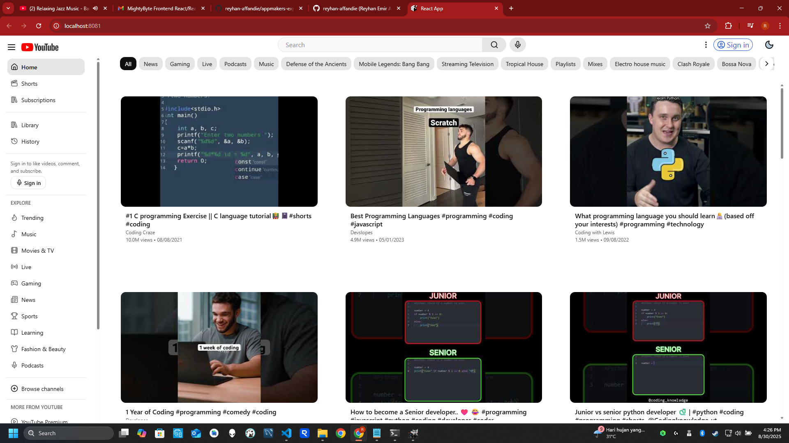
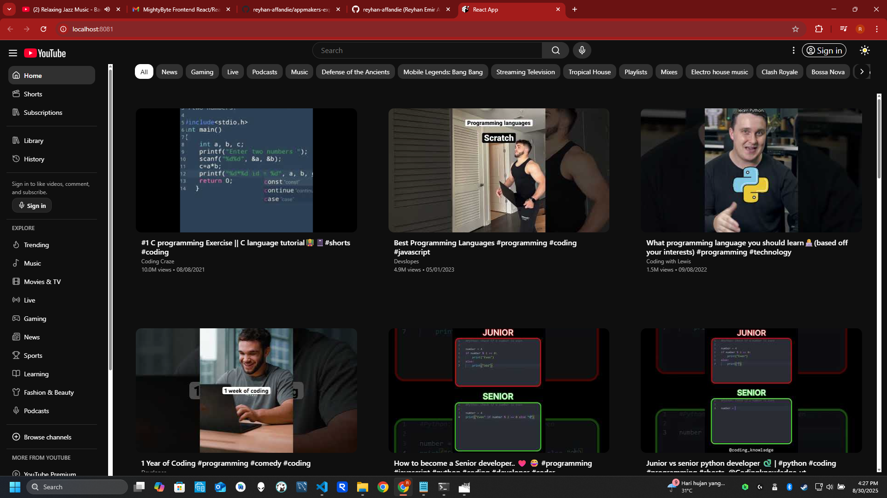
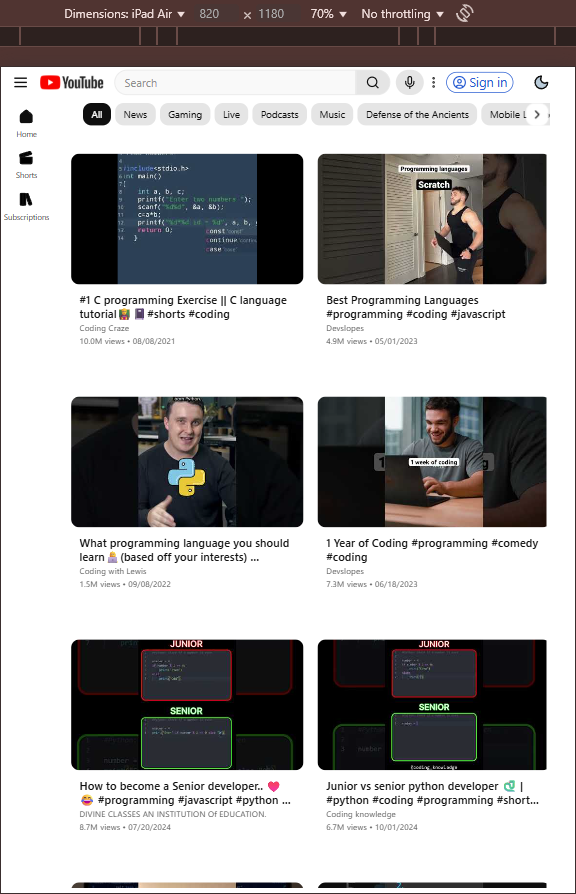
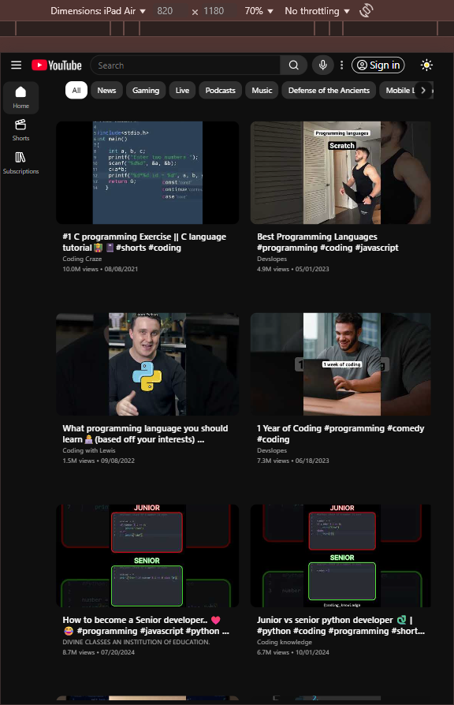
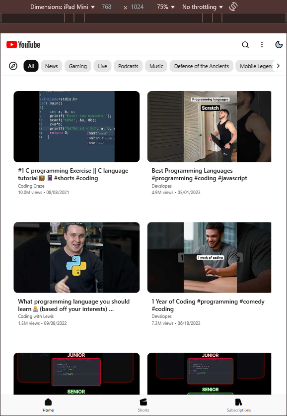
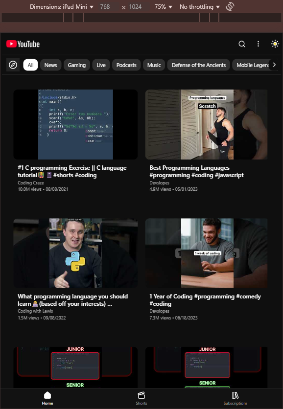
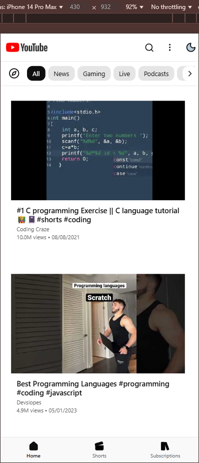
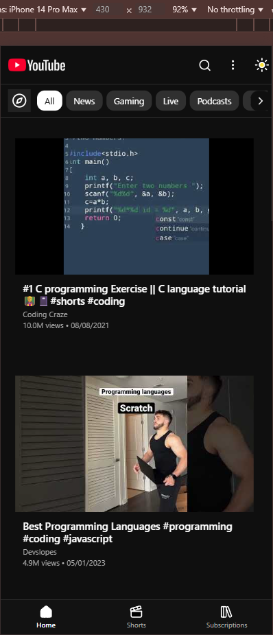

# MightyByte YouTube Grid - React Native + Expo + React Native Web

A clean React Native implementation of YouTube’s homepage video grid, built for the MightyByte Frontend Challenge.  
This repo is a modernized companion to my CodeSandbox submission and runs locally with the latest Expo, React Native, and React Native Web without deprecated packages.

- **Live Demo (CodeSandbox):** https://md9kgg.csb.app/
- **CodeSandbox Project:** https://codesandbox.io/p/devbox/mightybyte-react-react-native-challenge-forked-md9kgg

## Disclaimer

- This app is a non-commercial frontend coding challenge demo that mimics parts of YouTube’s UI.
- Not affiliated with YouTube or Google. “YouTube” and the play logo are trademarks of Google LLC.
- The running demo uses the Wikimedia-hosted wordmark solely for visual parity in this challenge.
- If requested, I will replace it with a neutral icon immediately.

## Stack

- Expo (latest)
- React Native
- React Native Web
- TypeScript
- No UI framework; only `StyleSheet`

## Features

- Responsive grid layout with breakpoint-based columns
- Infinite scrolling with `FlatList` + `onEndReached`
- Hover preview on web using `Pressable` `onHoverIn`/`onHoverOut`
- Dates rendered as `MM/DD/YYYY`
- YouTube Data API v3 paging
- Simple hooks for data/state; no Redux
- Theme switcher (Light/Dark) ...

### Desktop

| Light                                        | Dark                                       |
| -------------------------------------------- | ------------------------------------------ |
|  |  |

### Tablet

| Light                                      | Dark                                     |
| ------------------------------------------ | ---------------------------------------- |
|  |  |

### Tablet Mini

| Light                                                | Dark                                               |
| ---------------------------------------------------- | -------------------------------------------------- |
|  |  |

### Mobile

| Light                                      | Dark                                     |
| ------------------------------------------ | ---------------------------------------- |
|  |  |

## Getting Started

**Requirements**

- Node LTS
- npm or pnpm
- Expo CLI (optional)

**Setup**

```bash
# install
npm i
# or
pnpm i

# env
cp .env.example .env
# then set your key:
# EXPO_PUBLIC_YT_API_KEY=your_api_key
```

**Run on web**

```bash
npm run web
# or
npx expo start --web
```

## Scripts

- `npm run web` - start Expo for web

## Project Structure

```
/src
  /assets
  /components
  /constants
  /hooks
  /public
  /screens
App.tsx
```

Key files:

- `hooks/useYoutube.ts` - data fetching and pagination
- `hooks/useYoutube.mock.ts` - provides mock data and pagination to speed up development and avoid hitting API limits
- `components/YtVideo/index.tsx` - video card with hover preview
- `screens/Home/page.tsx` - grid layout using `FlatList`

## Environment

Create `.env` from `.env.example` and set:

```
EXPO_PUBLIC_YT_API_KEY=your_key
```

Keys are not committed. An example file is provided.

## Technical Notes

- Hover behavior is web only; handlers are guarded so mobile is unaffected.
- Infinite scroll uses `onEndReachedThreshold` with a loading guard to avoid duplicate requests.
- Fields not returned by the API are skipped.
- Styling uses `StyleSheet` only.

## Troubleshooting

```bash
# if the web build fails, clear caches:
rm -rf node_modules .expo .expo-shared .metro
npm i
```
